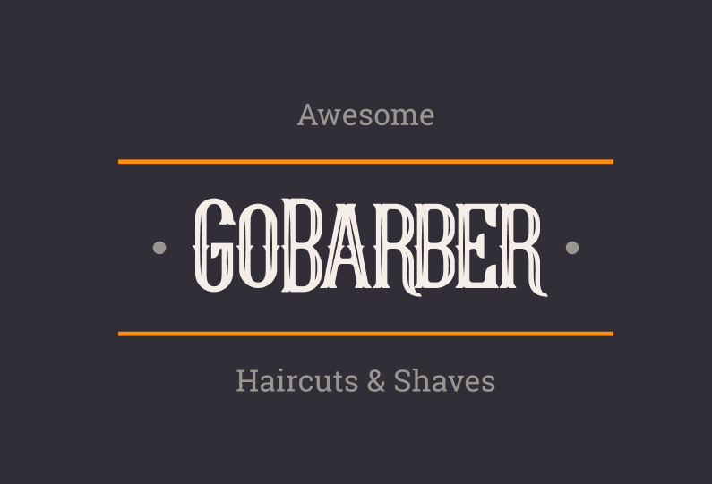
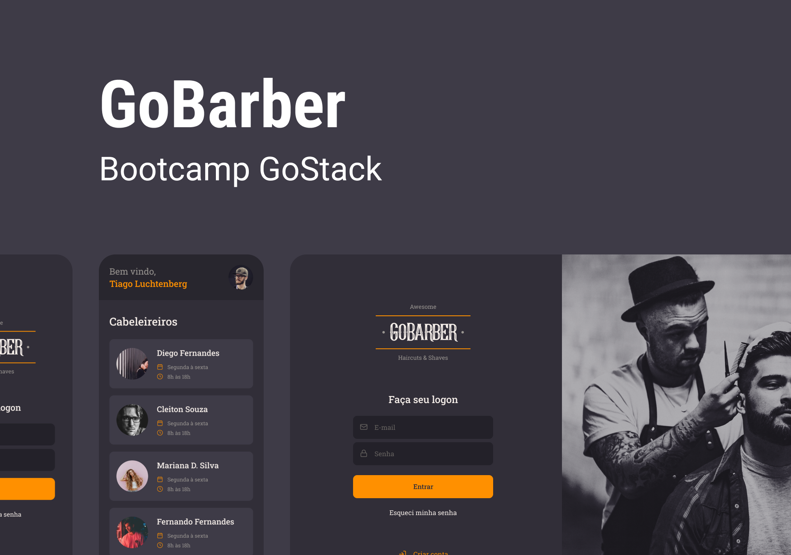
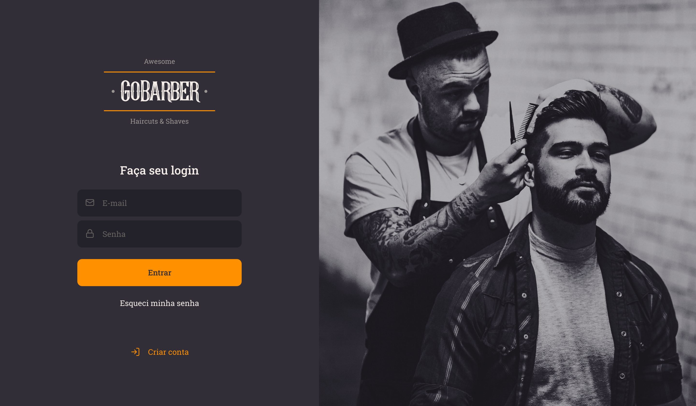
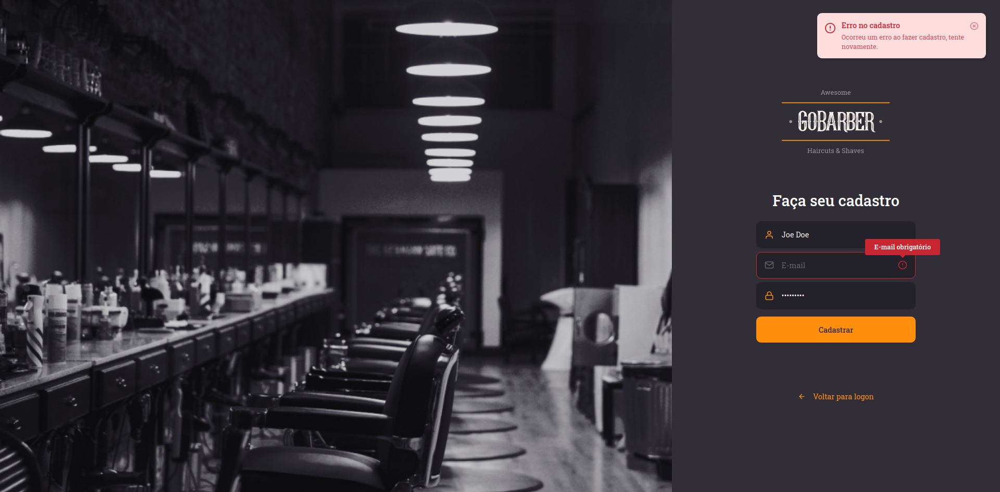
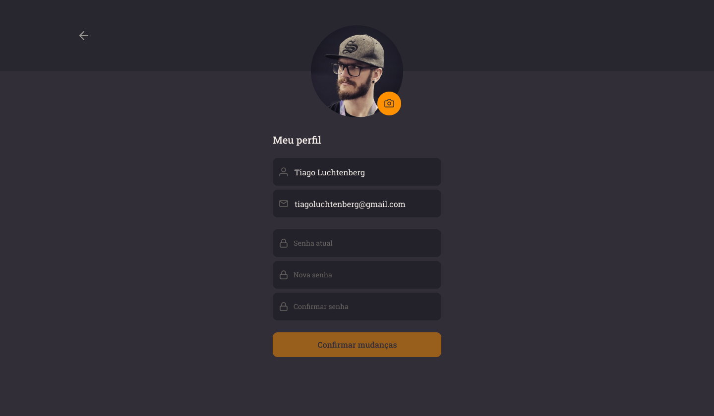

<h1 align="center">
 
  
 
</h1>

  
  
  
  
  

---

# See the repositories

### - [Mobile](https://github.com/alexandre-roa/app-GoBarber)

### - [Backend](https://github.com/alexandre-roa/GoBarber-backend)

---

## 🚀 Technologies

This project was developed with the following technologies:

- ✔️ Typescript

- ✔️ ReactJS

- ✔️ React Native

- ✔️ React Hooks

- ✔️ Context Api

- ✔️ NodeJS

- ✔️ React Hooks

- ✔️ Postgresql

- ✔️ Axios

- ✔️ TypeORM

- ✔️ Docker

Made with 💜 by Alexndre Roa 👋 [See my linkedin](https://www.linkedin.com/in/azaroa/)
